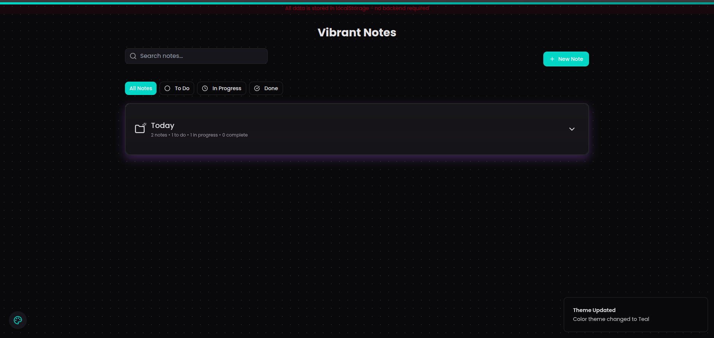
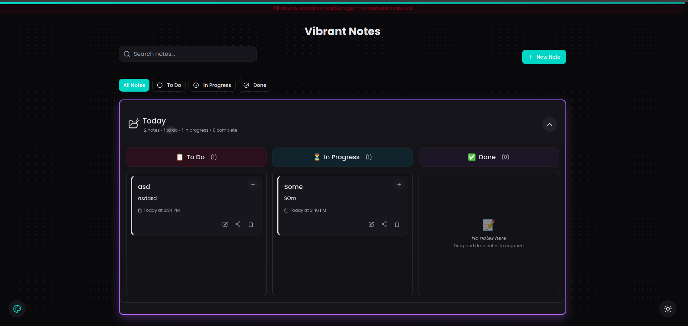
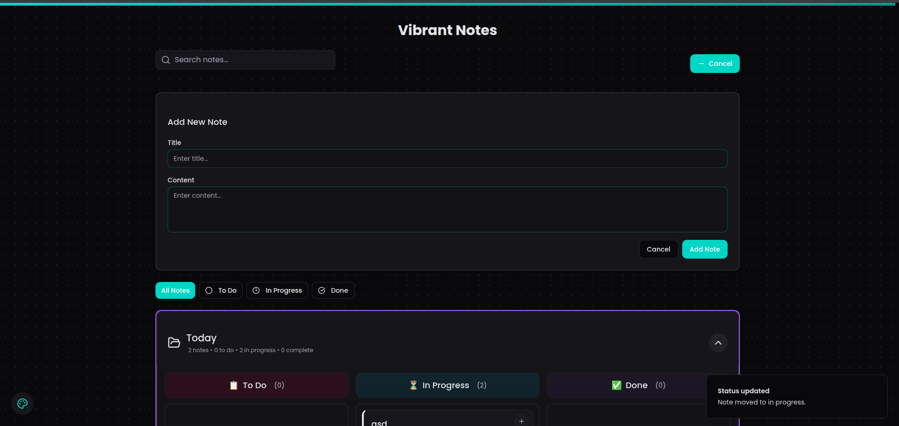
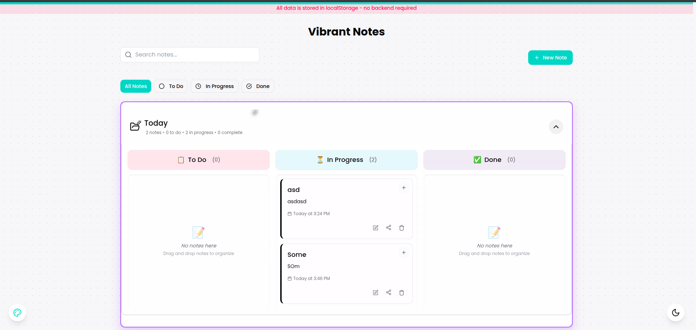
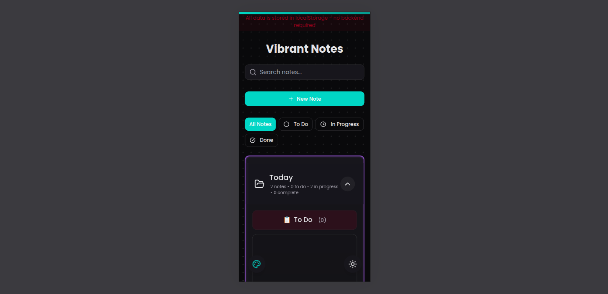

# Vibrant Notes ✨

A modern, interactive note management system with beautiful animations and intuitive organization.

## Features 🚀

- **Smart Organization**
  - 📁 Folder-based note management
  - 📌 Pin important notes
  - 🏷️ Status tracking (Todo, In Progress, Done)
  - 🔍 Quick search functionality

- **Rich User Experience**
  - 🎨 Multiple color themes
  - 🌓 Light/Dark mode support
  - ✨ Smooth animations
  - 🎯 Drag-and-drop task management

- **Modern Design**
  - 💫 Glassmorphic UI elements
  - 📱 Fully responsive layout
  - 🖼️ Clean, minimal interface
  - 🌈 Custom color schemes

## Screenshots 📸

### Dashboard Overview

*Main dashboard showing folders, pinned notes, and quick actions*

### Task Board View

*Kanban-style task board with drag and drop functionality*

### Note Editor

*Rich text editor with formatting options and color themes*

### Light Mode

*Elegant dark mode interface with vibrant accents*

### Mobile Responsive Design

*Responsive layout optimized for mobile devices*

## Animations & Interactions 🎬

### Folder Animations
- Smooth expand/collapse transitions
- Hover effects with sparkles
- Interactive glow effects
- Elastic spring animations

### Note Card Animations
- Fade in/out transitions
- Scale animations on hover
- Smooth deletion animations
- Pin/unpin effects

### Task Board Animations
- Drag and drop with physics
- Status change transitions
- Completion celebration effects
- Smooth reordering

### Button & Input Animations
- Hover scale effects
- Click feedback animations
- Focus state transitions
- Loading state animations

## Tech Stack 💻

- **Frontend Framework**: React with TypeScript
- **Build Tool**: Vite
- **Styling**: Tailwind CSS
- **UI Components**: shadcn/ui
- **Animations**: Framer Motion
- **Icons**: Lucide Icons

## Getting Started 🏁

1. **Clone the repository**
```bash
git clone <repository-url>
cd vibrant-notes
```

2. **Install dependencies**
```bash
npm install
```

3. **Start development server**
```bash
npm run dev
```

## Project Structure 📁

```
vibrant-notes/
├── public/
│   └── assets/
│       └── images/
├── src/
│   ├── components/
│   │   ├── ui/
│   │   ├── folders/
│   │   ├── notes/
│   │   └── taskboard/
│   ├── hooks/
│   ├── utils/
│   ├── styles/
│   ├── types/
│   ├── pages/
│   ├── App.tsx
│   └── main.tsx
└── package.json
```

## Key Components 🔑

### FolderButton
- Manages folder display and interactions
- Handles note organization
- Provides visual feedback
- Implements smooth transitions

### NoteCard
- Displays note content
- Handles edit/delete operations
- Manages pin status
- Implements hover effects

### TaskBoard
- Kanban-style task management
- Drag and drop functionality
- Status tracking
- Progress animations

## Contributing 🤝

We welcome contributions! Here's how you can help:

### Development Process

1. **Fork & Clone**
   ```bash
   git clone <your-fork-url>
   cd vibrant-notes
   ```

2. **Create a Branch**
   ```bash
   git checkout -b feature/your-feature-name
   ```

3. **Make Changes**
   - Follow the coding style
   - Add appropriate comments
   - Update documentation

4. **Test Your Changes**
   ```bash
   npm run test
   npm run lint
   ```

5. **Submit a Pull Request**
   - Describe your changes
   - Reference any related issues
   - Add screenshots if applicable

### Code Style Guidelines

- Use TypeScript for type safety
- Follow React best practices
- Write meaningful commit messages
- Add comments for complex logic
- Keep components modular

### Animation Guidelines

When adding new animations:
- Use Framer Motion for consistency
- Keep animations subtle and purposeful
- Ensure smooth performance
- Add proper exit animations
- Consider reduced motion preferences

## Performance Optimization 🚀

- Lazy loading of components
- Optimized animations
- Efficient state management
- Proper memo usage
- Image optimization

## Browser Support 🌐

- Chrome (latest)
- Firefox (latest)
- Safari (latest)
- Edge (latest)

## License 📄

MIT License - feel free to use this project for personal or commercial purposes.

---

Made with 💖 by [Your Name/Team]